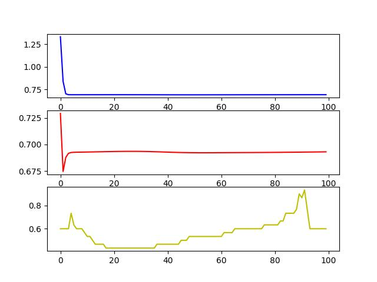

# 作业四——神经网络BP算法的实现
源程序详见：[nnet.py](./nnet.py)

## 实验数据构造

QAQ 非常抱歉周老师，暂时还没有想到如何构造一个输入特征维度为3，输出特征维度为2的数据集。

所以这里我使用本科时数据分析课程老师给出的[逻辑回归数据集](./data/train.txt)示例当作神经网络学习的对象。

数据集示例：

| feature1  | feature2  | label |
| :-------: | :-------: | :---: |
| 0.667394  | 12.741452 |   0   |
| -2.460150 | 6.866805  |   1   |
| -0.196949 | 0.444165  |   1   |

该示例数据集包含70条训练集和30条测试集，输入特征维度为2，输出维度为1。

## 模型构建及初始化

构造一个前馈神经网络，包含输入层（2个神经元），3个隐层（分别为4，5，4个神经元），输出层（1个神经元）

  

这里使用 `numpy` 数组对每层神经元的权重及偏置进行随机初始化：

~~~python
class Net:

    def __init__(self, layers: list) -> None:
        
        self.init_network(layers)
        self.actions = []

    def init_network(self, layers: list):
        self.layers=len(layers)
        self.weights = []
        self.bias = []
        self.delta = []
        self.accuW = []
        self.accuO = []
        for i in range(self.layers-1):
            self.weights.append(np.random.random([layers[i+1],layers[i]]))
            self.bias.append(np.random.random([layers[i+1]]))
            self.accuW.append(np.zeros([layers[i+1],layers[i]]))
            self.accuO.append(np.zeros([layers[i+1]]))
            self.delta.append(np.zeros(layers[i+1]))
            
net = Net([2,4,5,4,1])
~~~

## 模型训练

### 前向传播

对于训练数据集中的每条数据，执行以下操作：

1. 根据模型参数计算得到输出`yh`
2. 保存中间输出，为反向传播做铺垫

~~~python
def ForwardPropagation(self, input:np.array) -> float:
        loss = 0
        m = len(input)
        for data in input:
            self.actions.append(data[:-1])
            for i in range(self.layers-1):
                a = self.actions[-1]
                z = self.weights[i].dot(a) + self.bias[i]
                self.actions.append(Sigmoid(z))
            yh = self.actions[-1]
            y = data[-1]
            loss += -(y*np.log(yh) + (1-y)*np.log(1-yh))
            self.delta[-1] = yh - y
            for i in range(self.layers-3,-1,-1):
                prime = self.actions[i+1] * (1-self.actions[i+1])
                self.delta[i] = self.weights[i+1].T.dot(self.delta[i+1]) * prime
            for i in range(self.layers-1):
                self.accuW[i] += np.outer(self.delta[i], self.actions[i])
                self.accuO[i] += self.delta[i]
        
        for i in range(self.layers-1):
            self.accuW[i] += self.accuW[i] / m
            self.accuO[i] += self.accuO[i] / m
        loss = loss / m
        return loss
~~~

### 反向传播

根据accuW和accuO中累计的梯度值分别对网络中的weights和bias进行更改：

~~~python
def BackPropagation(self,alpha=0.1):            
        for i in range(self.layers-1):
            self.weights[i] -= alpha * self.accuW[i]
            self.bias[i] -= alpha * self.accuO[i]
        self.accuW[i] = np.zeros(self.accuW[i].shape)
        self.accuO[i] = np.zeros(self.accuO[i].shape)
~~~

### 标签预测

仅仅只根据单条数据预测网络输出，不保存梯度和中间结果。

~~~python
    def predict(self, input:np.array):
        actions = input
        for i in range(self.layers-1):
            a = actions
            z = self.weights[i].dot(a) + self.bias[i]
            actions = Sigmoid(z)
        yh = actions
        return yh
~~~

## 模型评估

在每一轮训练结束时对模型分类效果进行测试，主要评价标准为模型的准确率和测试集上的预测交叉熵损失：

~~~python
correct = 0
lossTst = 0
for data in testSet:
	y = data[-1]
	yHat = net.predict(data[:-1])
	lossTst += -(y*np.log(yHat) + (1-y)*np.log(1-yHat))
	if yHat > 0.5:
		ans = 1
	else:
		ans = 0
	if ans == y:
		correct += 1
~~~

## 实验结果

实验设定：

+ 学习率：1e-3
+ 训练轮次：100

### 实验结果图像

其中蓝色曲线代表训练损失`train loss`，红色曲线代表测试集上损失`test loss`，黄色曲线代表测试集上的准确率`accuracy`。

### 实验分析

+ 从训练集和测试集损失曲线可以看出，模型在短时间内即拟合到了几乎收敛的程度
+ 测试集在达到最低点后慢慢上升，可能是出现了过拟合现象
+ 准确率曲线波动较大最后稳定在低于最高点的水平，可能是由于训练集与测试集分布差距导致的