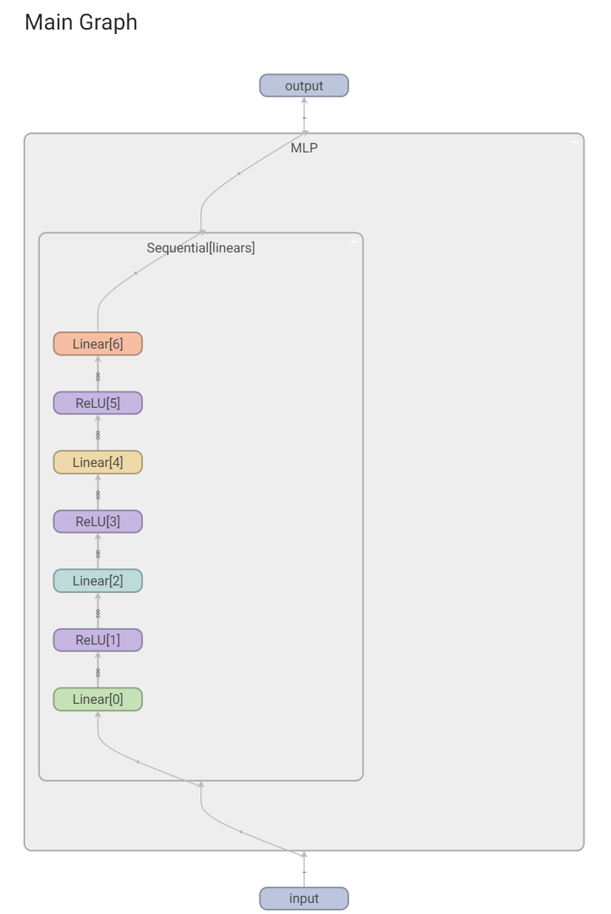
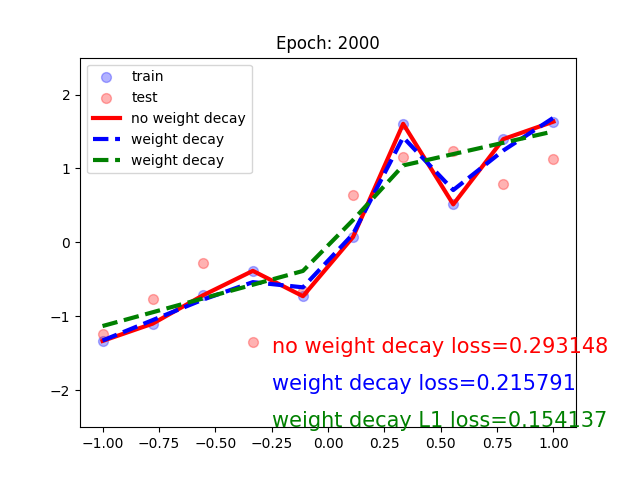
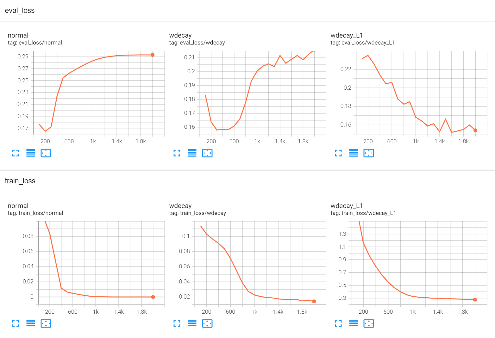
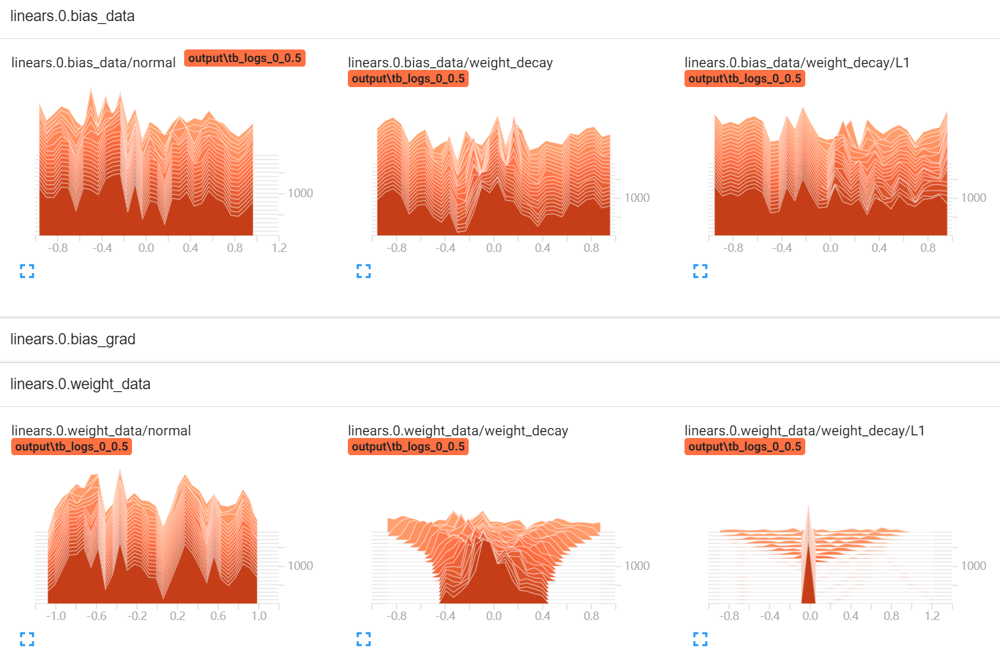
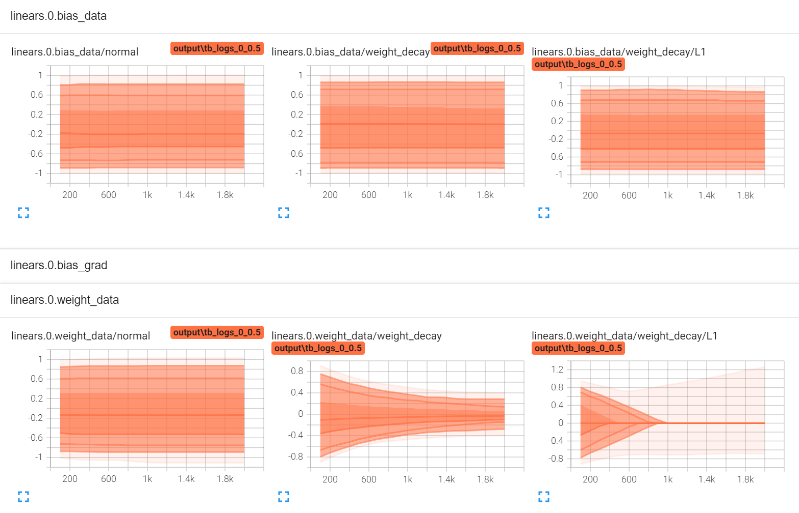

# 权重衰减（weight decay）实验及分析

利用Pytorch对L1和L2正则分别进行实现，并对权重衰减的影响进行对比。

通用参数设定如下，具体含义参考[代码](./weight_decay.py)：

~~~
torch.manual_seed(42)
n_hidden = 200
max_iter = 2000
disp_interval = 100
lr_init = 1e-2
num_data = 10
mean = 0
squard = 0.5
~~~

## 模型可视化

模型较为简单：

训练 2K 个step之后的结果如下：

+ 可以明显看到，正则化后的曲线拟合程度低于非正则化，避免了过拟合风险，在测试集上也拥有更少的损失。
+ 同时，L1 相较于 L2 拟合曲线更平坦，在数据分布更复杂的场景可能会欠拟合
+ L2 介于 L1 和非正则之间，相当于一个平滑的过度，对数据的扰动更鲁棒

## 训练损失

可以看出，不使用正则化的拟合曲线更容易过拟合，测试集上的损失一路上升。加入L2正则的模型在测试集损失上有一个很明显的凹陷，说明它先拟合后过拟合，对比之下L1正则更不容易过拟合。

## 数据分布分析

可以看到：

+ bias在训练过程中由于没有加入正则化过程，所以参数的变化较为均匀，符合预期。
+ L2 正则化会导致weight参数随着训练次数的增加不断收缩，极端参数减少，过程较为平滑
+ L1正则化会使参数变稀疏，并且速率会比较快，在途中也很好的体现了出来

L1 与 L2 最大的不同点就在于参数的稀疏性和参数变化的速率上，图中可以看出L1正则化下的参数会迅速缩小至0。

## 参考资料

+ [权重衰减（weight decay）与学习率衰减（learning rate decay）](https://blog.csdn.net/program_developer/article/details/80867468)
+ [详解L1和L2正则化](https://blog.csdn.net/baidu_32885165/article/details/110085688)